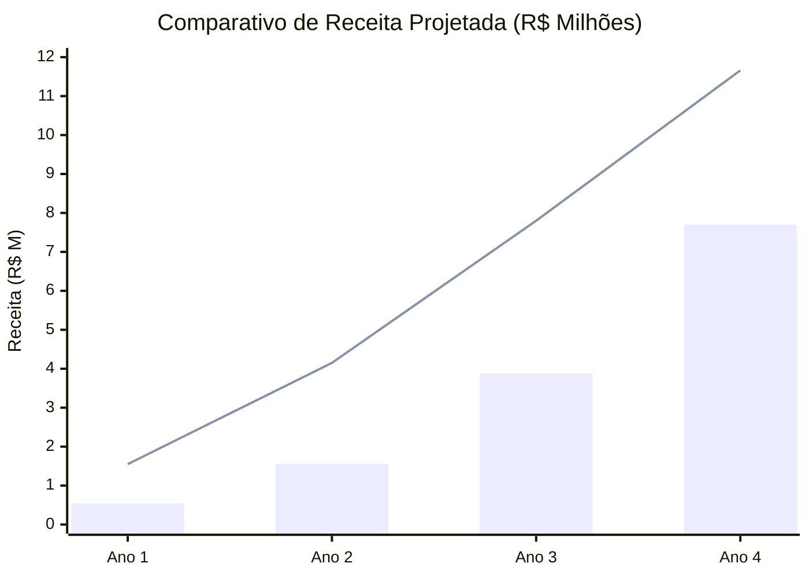

# RAIX — Análise de Sensibilidade de Projeções (Cenários B e C)

## Resumo Executivo
Este relatório consolida a projeção financeira da Raix Tech através de uma análise de sensibilidade com dois cenários distintos (Cenário B - Enxuto e Cenário C - Híbrido). O objetivo é apresentar o nível de maturidade do planejamento corporativo, evidenciando a viabilidade do negócio tanto sob premissas conservadoras (B) quanto em modelos otimizados de aceleração e penetração de mercado B2B (C). 

Ambos os cenários respeitam integralmente o princípio basilar da plataforma: **privacidade forte por design, com retenção limitada de metadados**.

---

## 1. Tabela Comparativa de Cenários

| Métrica | Cenário B (Enxuto) | Cenário C (Híbrido) |
| :--- | :--- | :--- |
| **Captação Alvo** | R$ 700k | R$ 1,4M a R$ 1,6M |
| **Receita Ano 1** | R$ 540k | ~R$ 1,55M |
| **Receita Ano 2** | R$ 1,56M | R$ 4,15M |
| **Receita Ano 3** | R$ 3,88M | R$ 7,80M |
| **Receita Ano 4** | R$ 7,70M | R$ 11,66M |
| **Break-even (Ponto de Equilíbrio)** | Ano 2 | Ano 1 (Impulsionado pelo mix B2B) |
| **Margem EBITDA (Ano 4)** | ~51% | ~80% a 90% (Escala de Software) |

---

## 2. Premissas de Cada Cenário

### Cenário B (Enxuto)
* **Plano de Captação:** R$ 700k, focado em garantir a base operacional inicial.
* **Equipe & Estrutura:** Crescimento orgânico e cauteloso, com expansão de time atrelada estritamente à geração sustentável de fluxo de caixa positivo.
* **Dinâmica Comercial:** Tração mais lenta e compassada (atingimento do *Break-even* no Ano 2), assumindo adoção gradativa com foco em validação contínua de nichos e um ciclo de vendas B2B estendido.
* **Rentabilidade:** Margem EBITDA estimada em ~51% no quarto ano, refletindo um modelo de escala mais modesto no médio prazo.

### Cenário C (Híbrido)
* **Plano de Captação:** R$ 1,4M a R$ 1,6M, estruturado para tracionar rapidamente a aquisição de clientes corporativos com alocação robusta em CAC.
* **Equipe & Estrutura:** Equipe de *Go-to-Market* (GTM) agressiva, com expansão imediata da força de vendas, suporte e atendimento para escalar o portfólio.
* **Dinâmica Comercial:** Forte *mix* corporativo alavancando receitas B2B (recorrentes e implantações empresariais), permitindo atingir o *Break-even* de forma antecipada logo no Ano 1.
* **Rentabilidade:** Margem EBITDA de ~80% a 90% no quarto ano, evidenciando as fortes alavancas operacionais e a escalabilidade elástica inerentes a um modelo de produto de software proprietário.

---

## 3. Gráfico de Projeções (Receita Comparativa Anual)

*(Legenda Visual: As barras representam a evolução da Receita no Cenário B - Enxuto; a linha contínua representa a aceleração da Receita no Cenário C - Híbrido)*

---

## 4. Notas e Exoneração de Responsabilidade (Disclaimer)

<strong>NOTA IMPORTANTE:</strong> Os dados apresentados neste relatório referem-se estritamente a um <strong>cenário projetado de adoção — estimativa de Análise de Negócio, NÃO representando resultado financeiro atual ou faturamento realizado</strong>. O projeto encontra-se na fase pré-receita, operando atualmente com 5 (cinco) pilotos técnicos em andamento. Todas as métricas projetadas têm caráter ilustrativo e dependem fundamentalmente das flutuações de mercado e da execução de adoção.

