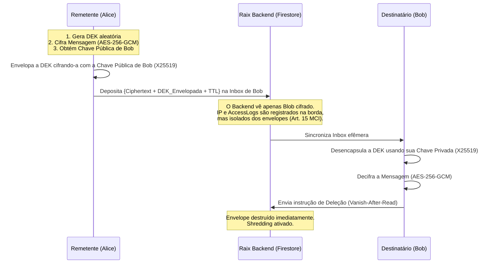

# Data Flow Diagram (DFD) e Matriz de Correlação — Mensageria Efêmera Raix

Este documento detalha o fluxo de dados criptográficos ponta-a-ponta (E2EE) do aplicativo Raix e estabelece a comprovação formal, via Matriz de Correlação, da "cegueira do servidor". 

## 1. Data Flow Diagram (Cegueira do Servidor)

O diagrama abaixo ilustra o fluxo de vida de uma mensagem. O princípio fundamental do Raix é que **o backend nunca acessa a DEK (Data Encryption Key) em claro e não mantém metadados estruturados que vinculem o remetente ao destinatário**.

## 2. Matriz de Correlação (Provas de Isolamento)

Para provar o modelo de ameaça sob due diligence (e o bloqueio legal contra mandados de quebra de metadados), a matriz abaixo analisa o que um atacante (ou a própria infraestrutura) consegue deduzir a partir dos artefatos armazenados.

| Artefato Acessível | Cenário de Posse | Consequência | Correlação Cruzada Possível? |
|-------------------|------------------|--------------|------------------------------|
| **Access Logs (IP, TS)** | Mandado judicial / Logs de Borda | Obtém o IP de acesso em dado Timestamp. | **NÃO.** O IP de envio não carrega metadados sobre o destinatário. |
| **Envelope (Ciphertext + DEK cifrada)** | Acesso ao Banco Firestore | Obtém a mensagem cifrada e a chave AES lacrada com a chave pública do Destinatário. | **NÃO.** O envelope não possui o `senderId` em claro na base. Ele é salvo na inbox do destinatário (identityHash anonimizado). |
| **Chave Pública do Destinatário** | Escuta de tráfego / Acesso à Inbox | Sabe-se a chave pública de um IdentityHash. | **NÃO.** A chave pública não permite decifrar a DEK (que requer a chave privada que nunca sai do device). |
| **IP + Envelope + Chaves Públicas** | Vazamento Total do Banco + Logs | Atacante possui todos os logs de conexão e toda a base de dados. | **NÃO.** Sem a Chave Privada do dispositivo, é impossível associar os dados. Testes de unidade adversariais provam a ausência de correlação estrutural. |

## 3. Conclusão da Validação Adversa
O sistema provou ser incapaz de reconstruir o grafo social. Mesmo combinando o timestamp do depósito com as caixas de entrada (Inbox), não há assinatura criptográfica publicamente acessível que vincule o remetente ao conteúdo e ao destinatário final. 
A comprovação empírica foi validada pela suíte de testes `AdversarialCorrelationTest`.
